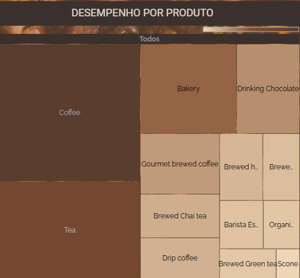
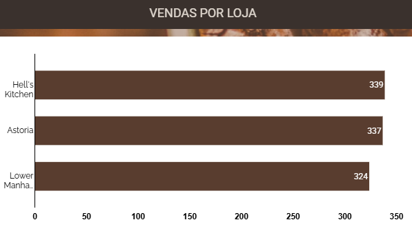
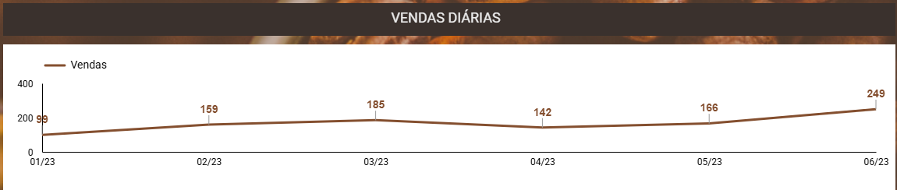
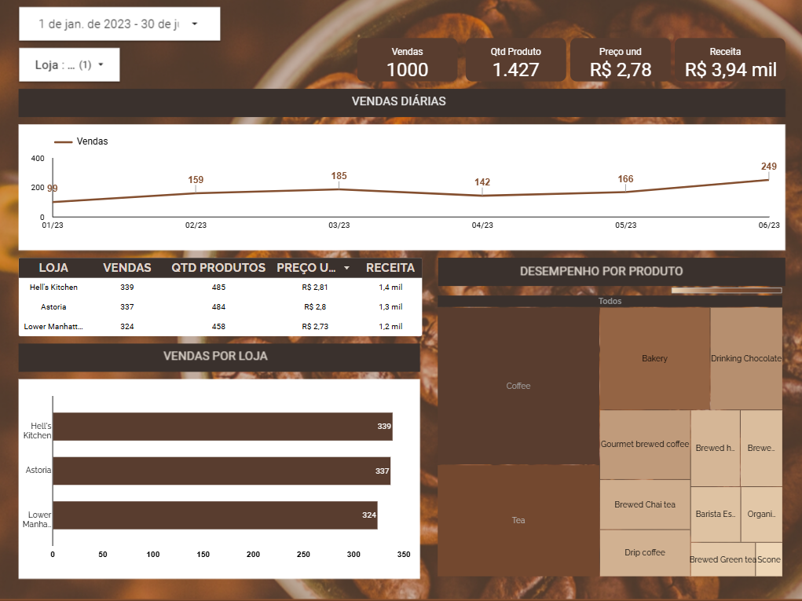

# 📊 Análise de Vendas – Dashboard em Looker Studio

## 📌 Visão Geral
Este projeto faz parte do **curso de Cientista de Dados** e tem como objetivo transformar dados de vendas em **insights estratégicos**, utilizando o **Looker Studio** para construção de um dashboard interativo e orientado à tomada de decisão.

O painel foi desenvolvido com foco em **performance comercial**, permitindo identificar produtos mais rentáveis, lojas com melhor desempenho e padrões temporais de vendas. Neste caso hipotetico o demandante precisava acompanhar as vendas diariamente e compreender quais eram as principais lojas e produtos vendidos. Além disso, havia a necessidade de visualizar **KPIs estratégicos** que auxiliassem na identificação de padrões de comportamento, monitoramento de desempenho e suporte à tomada de decisões baseadas em dados.

🔗 **Acesse o relatório interativo:**  
https://lookerstudio.google.com/s/nnuOC9bebtE

---

## 🎯 Objetivo do Projeto
Fornecer uma visão clara e integrada das vendas, respondendo perguntas como:
- Quais produtos geram maior receita?
- Quais lojas apresentam melhor desempenho?
- Como as vendas evoluem ao longo do tempo?
- Quais indicadores-chave ajudam a monitorar resultados rapidamente?

---

## 📖 Storytelling dos Dados
O dashboard foi estruturado para conduzir o usuário em uma **narrativa lógica**:

1. **Visão geral do negócio**, por meio de KPIs estratégicos  
2. **Análise de desempenho por produto**, identificando líderes de vendas  
3. **Comparação entre lojas**, avaliando participação na receita total  
4. **Evolução temporal das vendas**, destacando padrões diários  

Essa abordagem permite uma leitura intuitiva, indo do **macro para o detalhado**.

---

## 📈 Principais Visualizações

### 🔹 Indicadores-Chave (KPIs)

Os KPIs apresentam uma visão rápida do desempenho geral, como volume de vendas e receita total, facilitando o acompanhamento de resultados e a identificação de desvios.

---

### 🔹 Desempenho por Produto

Este gráfico permite identificar quais produtos são responsáveis pela maior parcela da receita, auxiliando decisões sobre estoque, precificação e foco comercial.

---

### 🔹 Receita por Loja

A visualização compara o desempenho das lojas, evidenciando aquelas com maior contribuição para a receita total e possíveis oportunidades de melhoria.

---

### 🔹 Vendas por Loja

Mostra o volume de vendas por unidade, permitindo avaliar eficiência operacional e performance individual das lojas.

---

### 🔹 Vendas Diárias

Este gráfico temporal ajuda a identificar padrões de comportamento ao longo dos dias, como picos de vendas, sazonalidade ou quedas relevantes.

### 🔹 Dashboard completo

---

## 🛠️ Ferramentas Utilizadas
- **Looker Studio**
- **Análise Exploratória de Dados**
- **Storytelling com Dados**
- **Visualização de Dados para Negócios**

---

## ✅ Conclusão
O projeto demonstra a aplicação prática de conceitos de **análise de dados e visualização**, reforçando a importância do storytelling para transformar dados brutos em informações acionáveis, apoiando decisões estratégicas de negócio.

---

📌 *Projeto desenvolvido para fins educacionais e composição de portfólio em Ciência de Dados.*
