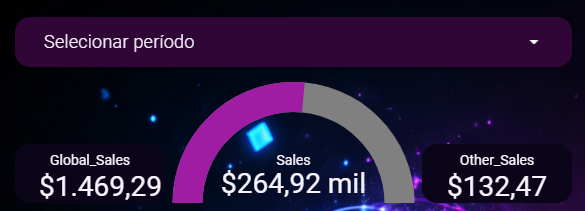
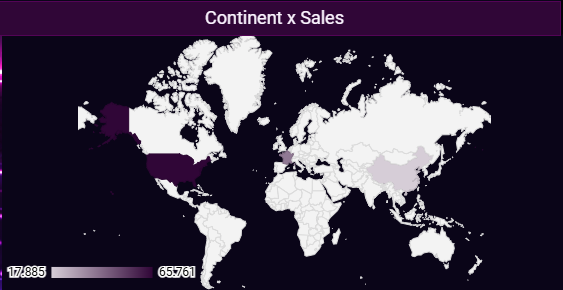
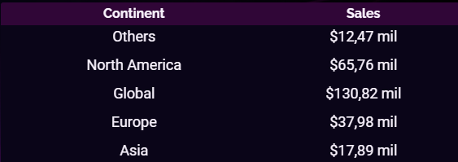
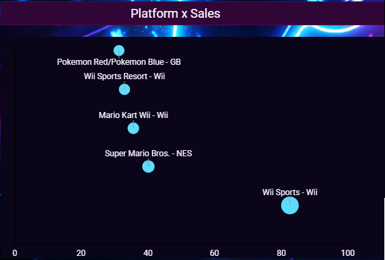
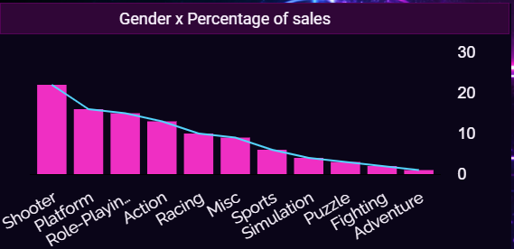
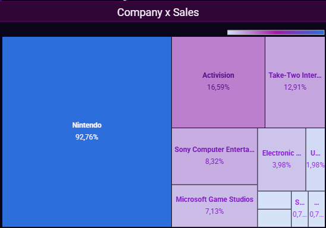
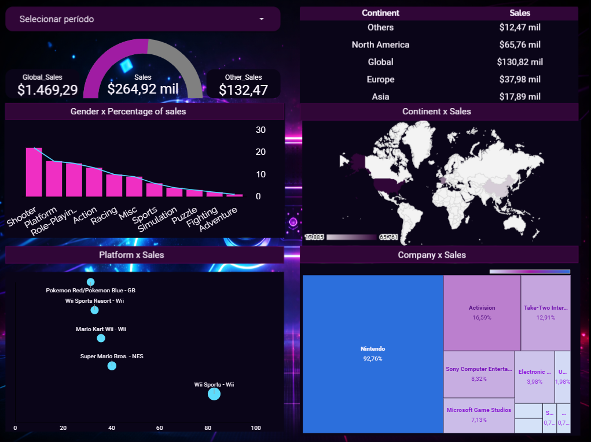

# 🎮 Dashboard de Análise de Vendas Globais de Video Games

Este projeto apresenta um **dashboard interativo desenvolvido no Looker Studio**, com foco na **análise de vendas globais de video games**.  
O objetivo é fornecer uma visão clara e estratégica sobre **desempenho por continente, plataforma, gênero e empresas**, apoiando a tomada de decisão baseada em dados.

🔗 **Acesse o relatório interativo:**  
https://lookerstudio.google.com/s/n37uJBjMp9Q

---
## Pergunta de negócio:
Como as vendas globais de video games se distribuem entre continentes, plataformas, gêneros e publishers, e quais segmentos concentram maior participação no mercado?

---
## 🧠 Contexto do Projeto

O demandante gostaria de:
- Acompanhar o desempenho global de vendas de jogos
- Identificar **continentes, plataformas e gêneros mais relevantes**
- Entender **quais empresas lideram o mercado**
- Visualizar indicadores de forma intuitiva e visualmente atrativa

O dashboard foi desenvolvido com **identidade visual inspirada no universo gamer**, utilizando cores neon e layout futurista.

---

## 📊 Principais Indicadores (KPIs)

Os KPIs no topo do dashboard apresentam uma visão geral do cenário:

- 💰 **Global Sales**: Total de vendas globais
- 🌍 **Other Sales**: Vendas em regiões secundárias
- 🎯 **Total Consolidado**: Soma geral das vendas analisadas

Esses indicadores permitem uma leitura rápida do desempenho geral do mercado.

---

## 🗺️ Distribuição Geográfica das Vendas

O mapa apresenta a **distribuição das vendas por continente**.  
Para garantir a correta visualização geográfica no Looker Studio, foi adotada uma modelagem baseada em países representativos por continente, respeitando as limitações nativas da ferramenta e preservando a análise em nível continental.

---

## 🌍 Vendas por Continente

Este gráfico permite comparar o desempenho de vendas entre continentes, evidenciando:
- Regiões com maior participação no mercado
- Diferenças de consumo entre mercados globais

---

## 🎮 Vendas por Plataforma

Análise do volume de vendas por plataforma, permitindo identificar:
- Consoles mais relevantes
- Concentração de vendas em plataformas específicas

Foi aplicado **Top 5 por ranking**, garantindo melhor legibilidade e foco analítico.

---

## 🧩 Vendas por Gênero (Percentual)

Visualização percentual da participação de cada gênero no total de vendas, facilitando:
- Comparação proporcional
- Identificação de preferências do mercado consumidor

---

## 🏢 Vendas por Empresa (Publisher)

Treemap que destaca as empresas com maior volume de vendas, evidenciando:
- Liderança de mercado
- Concentração de receita entre publishers

---
## Dashboard completo

---
## 🚧 Percalços e Aprendizados do Projeto

Durante o desenvolvimento, alguns desafios relevantes foram enfrentados:

- 🔍 **Problema de granularidade de dados**:  
  O ranking disponível no dataset era baseado em **jogos**, enquanto alguns gráficos utilizavam **plataformas** como dimensão, o que gerava inconsistências visuais.  
  → Solução: alinhamento do nível de granularidade entre ranking e visualização.

- 🗺️ **Limitação do mapa por continente no Looker Studio**:  
  O gráfico geográfico não renderizava corretamente todos os continentes.  
  → Solução: utilização de **países representativos** como âncora geográfica.

- 📊 **Exibição seletiva de rótulos (Top 5)**:  
  Evitou-se poluição visual ao exibir rótulos apenas para os itens mais relevantes.

Esses desafios contribuíram para um melhor entendimento sobre **modelagem de dados, limitações de ferramentas de BI e boas práticas de visualização**.
 ---

## 🧠 Principais Insights do Dashboard

- 🌍 América do Norte lidera o volume de vendas, indicando forte concentração do consumo e maior maturidade do mercado na região.

- 🎮 Poucas plataformas concentram a maior parte das vendas, reforçando a importância de estratégias focadas nos principais consoles.

- 🧩 Gêneros específicos dominam o mercado, sugerindo preferências claras do consumidor e oportunidades de investimento direcionado.

- 🏢 O mercado apresenta alta concentração entre grandes publishers, com poucas empresas respondendo por grande parte da receita global.

---

## 🛠️ Ferramentas Utilizadas

- **Looker Studio**
- **Google Sheets / CSV (fonte de dados)**
- Conceitos de:
  - Modelagem de dados
  - Storytelling com dados
  - Visualização e UX em BI

---

## 🚀 Conclusão

O dashboard entrega uma visão estratégica do mercado global de games, combinando:
- Clareza analítica
- Visual atrativo
- Decisões orientadas por dados

Este projeto demonstra a aplicação prática de Business Intelligence e Data Visualization na análise do mercado global de video games.
Ao integrar KPIs, mapas e gráficos estratégicos, o dashboard permite identificar padrões de consumo, concentração de mercado e oportunidades de negócio, reforçando decisões orientadas por dados.

---

📌 *Projeto desenvolvido para fins de estudo e portfólio.*
